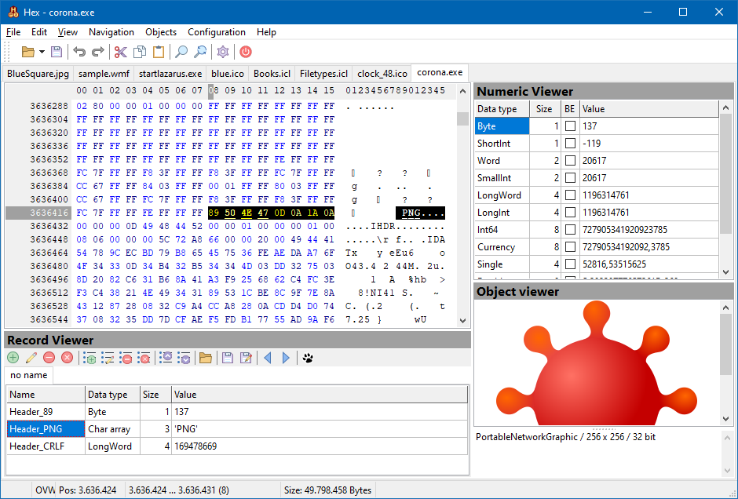

# Hex

Hex is an open source hex editor with some features which are useful for analyzing binary files ("reverse-engineering"):

* **Numeric viewer**: displays the byte selected by the cursor and the following bytes to standard Pascal numeric data types (byte, shortint, word, ..., singe, double, real48) as a usual number.
* **Record viewer**: allows to construct "records" from the basic Pascal types. The record elements are displayed in "human-readable" form. Commands are available to scroll through the file record by record.
* **Object viewer**: displays embedded images.

## Compilation

The application is distributed as Pascal source code only. It can be compiled with Lazarus v2.0+/FPC3.0+.
Third-party componets used are created at runtime and thus do not need installation of extra packages.

Tested on Windows 32bit/64 bit and Linux 64 bit, but it should work also on other platforms supported by Lazarus.

## Acknowledgements

Besides the Lazarus LCL, the application uses the following third-party components

* OMultiPanel: http://www.kluug.net/omultipanel.php
* MPHexEditor: https://github.com/michalgw/mphexeditor/blob/master/hexeditor.html

Most of the icons are taken from https://icons8.com, style "Office" (https://icons8.com/icons/office) and style "Simple small" (https://icons8.com/icons/small).
